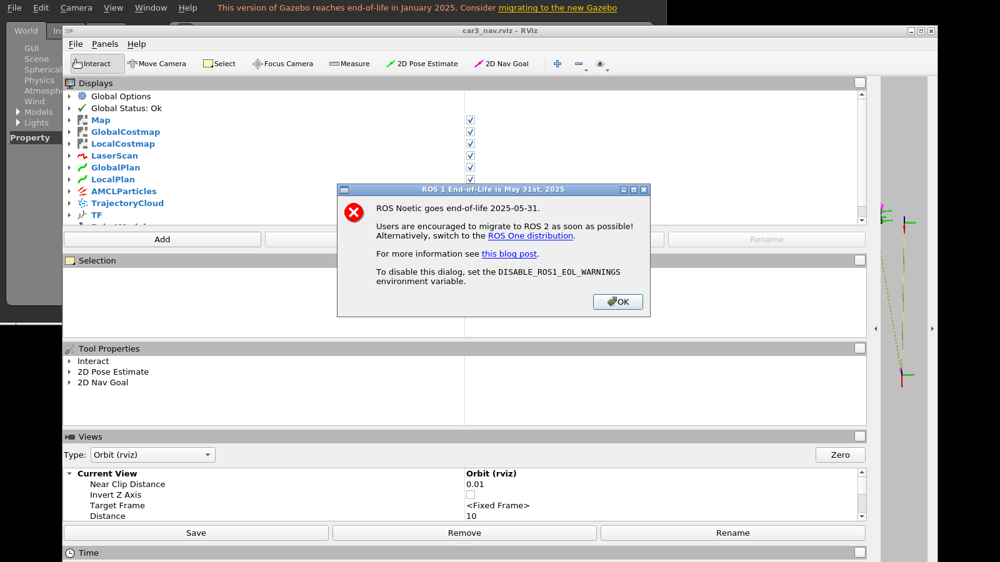

# XTDrone 单车仿真（single_car_simulation）

car3 麦轮（mecanum）小车在 Gazebo 中的**单车**全链路仿真：

```
/cmd_vel → 麦轮逆运动学 → ros_control → Gazebo 轮关节
建图：car3 激光 + gmapping → map_saver
导航：map_server + AMCL + 自研三阶段 nav_to_pose（转向对齐 → 直线平移 → 到位转向）
避障：激光势场横向平移避让 + 横向逃逸（右侧优先 → 卡住切左 → 死局中止）
```

Gazebo / RViz 直连宿主 X11（NVIDIA GPU 渲染），一键启动脚本见下文。

## 一、文件结构

```
├── docker/                          # 仿真环境（容器镜像）构建/运行脚本
│   ├── Dockerfile                   # xtdrone-noetic-px4 基础镜像构建（v0）
│   ├── build.sh                     # 构建镜像（网络慢可加代理参数）
│   ├── run.sh                       # 启动容器 xtdrone-dev（--gpus all + host 网络 + 挂载 workspace）
│   ├── entrypoint.sh                # 容器入口：source ROS / PX4 / 工作空间环境
│   ├── smoke_test.sh                # 容器环境自检（ROS / Gazebo / PX4 / GPU）
│   └── car3_env.sh                  # docker exec 环境脚本参考模板
├── workspace/
│   ├── swarm_defense_ws/            # catkin 工作空间（仅源码，编译产物已 gitignore）
│   │   └── src/
│   │       ├── basic_room_sim/      # 房间模型与 Gazebo world
│   │       │   ├── models/          # basic_room / 6_6_room / nesting_room
│   │       │   ├── worlds/
│   │       │   └── launch/
│   │       └── car3_control/        # 单车仿真核心包
│   │           ├── launch/          # bringup / slam / nav / nav_to_pose 启动文件
│   │           ├── config/          # ros_control 控制器、Gazebo PID
│   │           ├── params/          # AMCL / costmap / DWA / move_base / nav_to_pose 参数
│   │           ├── maps/            # 已建地图（当前主地图 nesting_room）
│   │           ├── rviz/            # RViz 配置
│   │           ├── scripts/         # car3_keyboard_control.py 键盘控制
│   │           └── src/             # C++ 节点：麦轮逆运动学 / ground_truth 里程计 /
│   │                                #   三阶段 nav_to_pose / 麦轮辊子抓地力 Gazebo 插件
│   ├── car3_demo.sh                 # 一键全链路演示（Gazebo + 导航 + RViz）
│   ├── car3_slam_nestingroom.sh     # nesting_room 手动建图
│   ├── car3_slam_66room.sh          # 6_6_room 手动建图
│   ├── nav_goal.py                  # 命令行发导航目标（支持多目标串行）
│   ├── set_pose.py                  # 重置 car3 位姿与 AMCL 初始位姿
│   ├── box_tool.py                  # 动态生成/删除障碍物
│   ├── box_obs.sdf / wall_obs.sdf / wall_long_obs.sdf / wall_x_obs.sdf   # 障碍物模型
│   └── car3_全链路开发报告.md        # 完整开发文档（系统链路图、几何参数、全部文件内容）
└── images/                          # 演示截图
```

## 二、环境准备

仿真运行在 docker 容器 `xtdrone-dev` 中（镜像 `xtdrone-noetic-px4:1.13.2-v1.3`，
Ubuntu 20.04 + ROS Noetic + Gazebo 11 + PX4 SITL + XTDrone）。

### 1. 获取仿真镜像

- **方式 A（推荐）**：加载现成镜像导出包（约 11.8 GB，未随仓库上传）：
  ```bash
  docker load -i xtdrone_noetic_px4_v0.tar
  ```
- **方式 B**：从源码构建基础镜像（v0），再补装 car3 所需软件包：
  ```bash
  cd docker && ./build.sh
  # 构建慢可走代理：HTTP_PROXY=http://127.0.0.1:7897 HTTPS_PROXY=http://127.0.0.1:7897 ./build.sh
  # 镜像内需补装：ros-noetic-velocity-controllers、ros-noetic-gmapping
  ```

### 2. 启动容器

```bash
cd docker && ./run.sh
```

容器参数：`--network host --gpus all`，宿主机 `~/xtdrone_docker/workspace` 挂载到 `/workspace`。
宿主侧需授权 X11：`xhost +local:`（X 重启后需重新执行）。

### 3. 编译工作空间

```bash
docker exec xtdrone-dev bash -c "source /home/dev/car3_env.sh && \
  cd /workspace/swarm_defense_ws && catkin_make"
```

若容器内没有 `car3_env.sh`，用 `docker/car3_env.sh` 模板创建到 `/home/dev/`。
（模板默认 DISPLAY=:99 软件渲染；直连宿主 X 时改为 :1 并去掉 `LIBGL_ALWAYS_SOFTWARE=1`。）

## 三、运行单车仿真

### 1. 一键演示（推荐）

```bash
docker exec -it xtdrone-dev bash /workspace/car3_demo.sh
```

脚本自动完成：清理残留进程 → 启动 Gazebo(nesting_room) + ros_control + 麦轮控制器 +
ground_truth 里程计 + 激光 + map_server + AMCL + 三阶段 nav_to_pose → 启动 RViz 并摆放窗口。
窗口直接显示在宿主机桌面（NVIDIA GPU 渲染）。

**发导航目标**（两种方式）：

- RViz 工具栏 `2D Nav Goal`：在地图上点位置并拖出方向；
- 命令行多目标串行：
  ```bash
  docker exec xtdrone-dev bash -c "source /home/dev/car3_env.sh && \
    python3 /workspace/nav_goal.py '1.5,-1.5,0' '-1.0,-0.5,0' '-2.0,-1.0,0' '0.5,-2.0,0' '0.0,-0.5,0'"
  ```

演示期间 Ctrl+C 一键关闭全部仿真进程。

### 2. 建图（SLAM）

```bash
docker exec -it xtdrone-dev bash /workspace/car3_slam_nestingroom.sh
# 6_6_room 地图用：docker exec -it xtdrone-dev bash /workspace/car3_slam_66room.sh
```

启动后为 Gazebo + gmapping + RViz + 键盘控制，在启动终端用键盘开车：

| 键 | 功能 | 键 | 功能 |
|---|---|---|---|
| w / s | 前进 / 后退 | + / - | 线速度档 |
| a / d | 左移 / 右移 | ] / [ | 角速度档 |
| q / e | 左转 / 右转 | 空格 | 停止 |

建图完成后另开终端保存地图：

```bash
docker exec xtdrone-dev bash -c "source /home/dev/car3_env.sh && \
  rosrun map_server map_saver -f /workspace/swarm_defense_ws/src/car3_control/maps/nesting_room"
```

### 3. 障碍物测试工具

```bash
docker exec xtdrone-dev bash -c "source /home/dev/car3_env.sh && \
  python3 /workspace/box_tool.py spawn box1 1.5 -1.0"          # 生成障碍物
docker exec xtdrone-dev bash -c "source /home/dev/car3_env.sh && \
  python3 /workspace/box_tool.py delete box1"                  # 删除障碍物
```

默认障碍物为 `box_obs.sdf`，可传路径用 `wall_obs.sdf` / `wall_long_obs.sdf` / `wall_x_obs.sdf` 生成不同形状。

### 4. 重置位姿

```bash
docker exec xtdrone-dev bash -c "source /home/dev/car3_env.sh && python3 /workspace/set_pose.py"
```

## 四、核心算法说明

三阶段 nav_to_pose（`car3_control/src/nav_to_pose_node.cpp`，动作接口 `/move_base`）：

1. **ALIGN** —— 原地转向，对准目标方位；
2. **TRANSLATE** —— 纯平移前进（角速度强制为 0），障碍物只用横向平移避让（激光势场）；
   正前方障碍触发横向逃逸：默认右侧优先，滑动窗口判定卡住后切左侧，超时无进展则中止目标；
3. **ROTATE_YAW** —— 到达目标半径内，转向期望朝向。

所有单点判定均带容差滞回（进入/退出半径不同），避免状态抖动。
完整设计见 `car3_全链路开发报告.md`。

## 五、演示截图



更多截图见 `images/` 目录。
