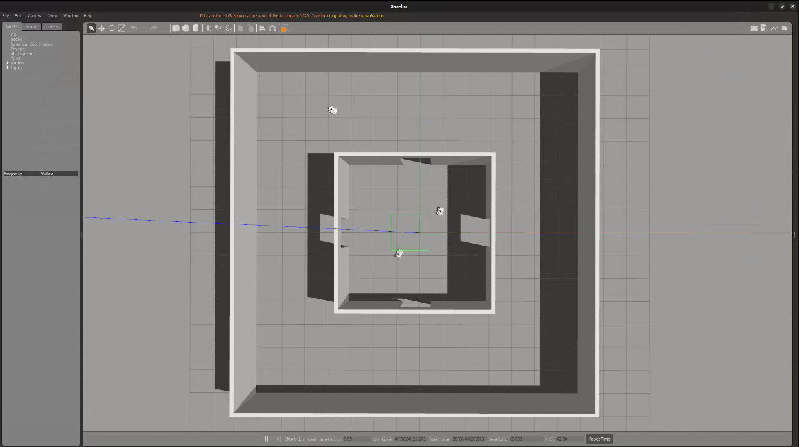
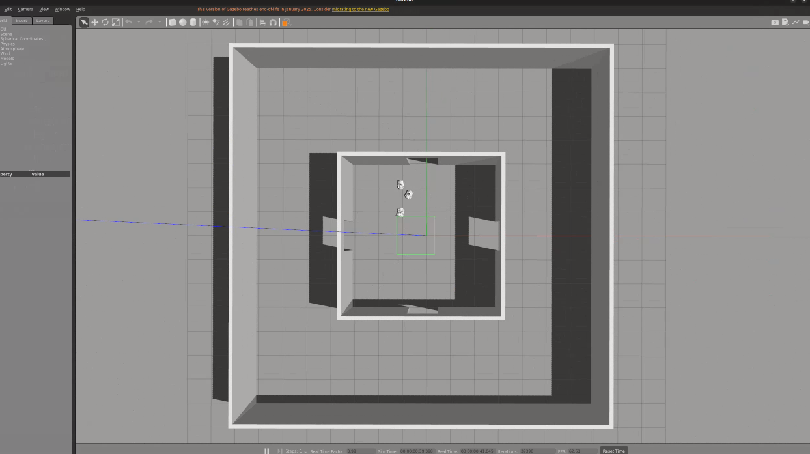

# XTDrone 仿真（single_car_simulation：单车全链路 + 多车协同任务）

car3 麦轮（mecanum）小车在 Gazebo 中的仿真，含**单车**全链路与**多车**协同任务两条线：

```
单车：/cmd_vel → 麦轮逆运动学 → ros_control → Gazebo 轮关节
建图：car3 激光 + gmapping → map_saver
导航：map_server + AMCL + 自研三阶段 nav_to_pose（转向对齐 → 直线平移 → 到位转向）
避障：激光势场横向平移避让 + 横向逃逸（右侧优先 → 卡住切左 → 死局中止）

多车：三车（car0/car1 防守 + car2 入侵）在 nesting_room 四门套间中的
     巡检—入侵—区域封控—协同围捕 一体化闭环任务（见第四节）

空地：两车两机（car0/car1 麦轮车 + iris_0/iris_1 防御无人机）围捕入侵无人机
     iris_2：Voronoi 逃逸 + 阵型封堵 + 凸包包围 + 捕获判定（见第五节）
```

Gazebo / RViz 直连宿主 X11（NVIDIA GPU 渲染），一键启动脚本见下文。

## 一、文件结构

```
├── docker/                          # 仿真环境（容器镜像）构建/运行脚本
│   ├── Dockerfile                   # xtdrone-noetic-px4 基础镜像构建（v0）
│   ├── build.sh                     # 构建镜像（网络慢可加代理参数）
│   ├── run.sh                       # 启动容器 xtdrone-dev（--gpus all + host 网络 + 挂载 workspace）
│   ├── entrypoint.sh                # 容器入口：source ROS / PX4 / 工作空间环境
│   ├── smoke_test.sh                # 容器环境自检（ROS / Gazebo / PX4 / GPU）
│   └── car3_env.sh                  # docker exec 环境脚本参考模板
├── workspace/
│   ├── swarm_defense_ws/            # catkin 工作空间（仅源码，编译产物已 gitignore）
│   │   └── src/
│   │       ├── basic_room_sim/      # 房间模型与 Gazebo world
│   │       │   ├── models/          # basic_room / 6_6_room / nesting_room
│   │       │   ├── worlds/
│   │       │   └── launch/
│   │       ├── car3_control/        # 单车仿真核心包
│   │       │   ├── launch/          # bringup / slam / nav / nav_to_pose 启动文件
│   │       │   ├── meshes/          # car3 模型 STL 网格（7 个，见第五节集成方法）
│   │       │   ├── config/          # ros_control 控制器、Gazebo PID
│   │       │   ├── params/          # AMCL / costmap / DWA / move_base / nav_to_pose 参数
│   │       │   ├── maps/            # 已建地图（当前主地图 nesting_room）
│   │       │   ├── rviz/            # RViz 配置
│   │       │   ├── scripts/         # car3_keyboard_control.py 键盘控制
│   │       │   └── src/             # C++ 节点：麦轮逆运动学 / ground_truth 里程计 /
│   │       │                        #   三阶段 nav_to_pose / 麦轮辊子抓地力 Gazebo 插件
│   │       └── car3_swarm/          # 多车协同任务核心包
│   │           ├── launch/          # multi_car3_mission.launch 一体化任务入口
│   │           │                    #   air_intruder_pursuit.launch 空中入侵围捕
│   │           ├── config/          # mission_params.yaml 任务参数（单一数据源）
│   │           │                    #   air_intruder_mission.yaml 空中入侵围捕参数
│   │           ├── scripts/         # patrol_node / intruder_node / mission_manager
│   │           │                    #   air_intruder_pursuit / uav_offboard_takeoff /
│   │           │                    #   ego_virtual_boundary / pick_spawn_corner
│   │           ├── src/             # C++：car_state_broadcaster / virtual_obstacle
│   │           └── *.md             # 使用 / 巡检模式 / 一体化任务 等开发文档
│   ├── car3_demo.sh                 # 一键全链路演示（Gazebo + 导航 + RViz）
│   ├── launch_air_intruder_sim.sh   # 空中入侵围捕：仿真启动（清理 + 选角 + launch）
│   ├── run_air_intruder_sim.sh      # 空中入侵围捕：一键运行（含起飞 + 围捕节点）
│   ├── 两车两机围捕一机_实现说明.md    # 空中入侵围捕实现说明（核心文件 / 算法 / 用法）
│   ├── mission_demo.sh              # 多车一体化任务一键演示（每轮随机换门、可多轮）
│   ├── mission_demo_up.sh           # 单门入侵演示：上门（UP）
│   ├── mission_demo_down.sh         # 单门入侵演示：下门（DOWN）
│   ├── mission_demo_left.sh         # 单门入侵演示：左门（LEFT）
│   ├── mission_demo_right.sh        # 单门入侵演示：右门（RIGHT）
│   ├── car3_slam_nestingroom.sh     # nesting_room 手动建图
│   ├── car3_slam_66room.sh          # 6_6_room 手动建图
│   ├── nav_goal.py                  # 命令行发导航目标（支持多目标串行）
│   ├── set_pose.py                  # 重置 car3 位姿与 AMCL 初始位姿
│   ├── box_tool.py                  # 动态生成/删除障碍物
│   ├── box_obs.sdf / wall_obs.sdf / wall_long_obs.sdf / wall_x_obs.sdf   # 障碍物模型
│   └── car3_全链路开发报告.md        # 完整开发文档（系统链路图、几何参数、全部文件内容）
└── images/                          # 演示截图
```

## 二、环境准备

仿真运行在 docker 容器 `xtdrone-dev` 中（镜像 `xtdrone-noetic-px4:1.13.2-v1.3`，
Ubuntu 20.04 + ROS Noetic + Gazebo 11 + PX4 SITL + XTDrone）。

### 1. 获取仿真镜像

- **方式 A（推荐）**：加载现成镜像导出包（约 11.8 GB，未随仓库上传）：
  ```bash
  docker load -i xtdrone_noetic_px4_v0.tar
  ```
- **方式 B**：从源码构建基础镜像（v0），再补装 car3 所需软件包：
  ```bash
  cd docker && ./build.sh
  # 构建慢可走代理：HTTP_PROXY=http://127.0.0.1:7897 HTTPS_PROXY=http://127.0.0.1:7897 ./build.sh
  # 镜像内需补装：ros-noetic-velocity-controllers、ros-noetic-gmapping
  ```

### 2. 启动容器

```bash
cd docker && ./run.sh
```

容器参数：`--network host --gpus all`，宿主机 `~/xtdrone_docker/workspace` 挂载到 `/workspace`。
宿主侧需授权 X11：`xhost +local:`（X 重启后需重新执行）。

### 3. 编译工作空间

```bash
docker exec xtdrone-dev bash -c "source /home/dev/car3_env.sh && \
  cd /workspace/swarm_defense_ws && catkin_make"
```

若容器内没有 `car3_env.sh`，用 `docker/car3_env.sh` 模板创建到 `/home/dev/`。
（模板默认 DISPLAY=:99 软件渲染；直连宿主 X 时改为 :1 并去掉 `LIBGL_ALWAYS_SOFTWARE=1`。）

## 三、运行单车仿真

### 1. 一键演示（推荐）

```bash
docker exec -it xtdrone-dev bash /workspace/car3_demo.sh
```

脚本自动完成：清理残留进程 → 启动 Gazebo(nesting_room) + ros_control + 麦轮控制器 +
ground_truth 里程计 + 激光 + map_server + AMCL + 三阶段 nav_to_pose → 启动 RViz 并摆放窗口。
窗口直接显示在宿主机桌面（NVIDIA GPU 渲染）。

**发导航目标**（两种方式）：

- RViz 工具栏 `2D Nav Goal`：在地图上点位置并拖出方向；
- 命令行多目标串行：
  ```bash
  docker exec xtdrone-dev bash -c "source /home/dev/car3_env.sh && \
    python3 /workspace/nav_goal.py '1.5,-1.5,0' '-1.0,-0.5,0' '-2.0,-1.0,0' '0.5,-2.0,0' '0.0,-0.5,0'"
  ```

演示期间 Ctrl+C 一键关闭全部仿真进程。

### 2. 建图（SLAM）

```bash
docker exec -it xtdrone-dev bash /workspace/car3_slam_nestingroom.sh
# 6_6_room 地图用：docker exec -it xtdrone-dev bash /workspace/car3_slam_66room.sh
```

启动后为 Gazebo + gmapping + RViz + 键盘控制，在启动终端用键盘开车：

| 键 | 功能 | 键 | 功能 |
|---|---|---|---|
| w / s | 前进 / 后退 | + / - | 线速度档 |
| a / d | 左移 / 右移 | ] / [ | 角速度档 |
| q / e | 左转 / 右转 | 空格 | 停止 |

建图完成后另开终端保存地图：

```bash
docker exec xtdrone-dev bash -c "source /home/dev/car3_env.sh && \
  rosrun map_server map_saver -f /workspace/swarm_defense_ws/src/car3_control/maps/nesting_room"
```

### 3. 障碍物测试工具

```bash
docker exec xtdrone-dev bash -c "source /home/dev/car3_env.sh && \
  python3 /workspace/box_tool.py spawn box1 1.5 -1.0"          # 生成障碍物
docker exec xtdrone-dev bash -c "source /home/dev/car3_env.sh && \
  python3 /workspace/box_tool.py delete box1"                  # 删除障碍物
```

默认障碍物为 `box_obs.sdf`，可传路径用 `wall_obs.sdf` / `wall_long_obs.sdf` / `wall_x_obs.sdf` 生成不同形状。

### 4. 重置位姿

```bash
docker exec xtdrone-dev bash -c "source /home/dev/car3_env.sh && python3 /workspace/set_pose.py"
```

## 四、运行多车仿真（巡检—入侵—区域封控—协同围捕）

三车（car0 / car1 防守方 + car2 入侵方）在 nesting_room 四门套间（上/下/左/右四门）中的
一体化闭环任务：`巡检 → 入侵 → 区域封控 → 协同围捕 → 捕获 → 最终对齐 → SUCCESS`。

### 1. 一键演示（随机门、可多轮）

```bash
docker exec -it xtdrone-dev bash /workspace/mission_demo.sh
```

脚本自动完成：清理残留仿真 → 启动 `multi_car3_mission.launch`（Gazebo + 三车 +
任务状态机/入侵车管理）→ 自动调用 `/mission/start`。每轮入侵门随机选取（不连续重复），
一轮结束后交互选择复位继续或退出。

### 2. 单门单轮演示

固定从某一个门入侵，单轮到达终态后自动停止仿真并退出（无复位、无多轮循环）：

```bash
docker exec -it xtdrone-dev bash /workspace/mission_demo_up.sh      # 上门 UP
docker exec -it xtdrone-dev bash /workspace/mission_demo_down.sh    # 下门 DOWN
docker exec -it xtdrone-dev bash /workspace/mission_demo_left.sh    # 左门 LEFT
docker exec -it xtdrone-dev bash /workspace/mission_demo_right.sh   # 右门 RIGHT
```

无界面（headless）运行加参数 `false`：
`docker exec xtdrone-dev bash /workspace/mission_demo_up.sh false`

### 3. 任务状态机（/mission/state）

| 状态 | 含义 |
|---|---|
| M_PATROL | car0/car1 按规划门序巡逻 |
| M_INTRUSION | 检测到 car2 进入内区 |
| M_CONTAINMENT_ACTIVE | 分配拦截/追捕角色，区域封控 |
| M_CAPTURE | 双车夹击捕获入侵车 |
| M_FINAL_ALIGN | 最终位姿对齐 |
| M_SUCCESS | 任务成功（result=CAPTURE） |
| M_FAILED_ESCAPE / M_INVALID_ESCAPE | 入侵车逃逸（合法门 / 原入口门） |

完整设计见 `car3_swarm/一体化任务文档.md`。

## 五、运行空中入侵无人机围捕（两车两机围捕一机）

**两车两机**（car0/car1 两辆麦轮车 + iris_0/iris_1 两架防御无人机）围捕一架入侵无人机
**iris_2**：iris_2 从外墙角出生（默认固定左下角 CORNER_1）→ 恒高 H_f=1.33m 飞越 3m 内墙 →
触发入侵警报 → 按 Voronoi 元胞质心逃逸；防御方按逃逸方向组阵，
边界门封堵 + 凸包包围收缩逼近捕获条件 → CAPTURED / ESCAPED。

### 1. 一键运行（推荐）

```bash
docker exec -it xtdrone-dev-gpu bash /home/dev/XTDrone-single-car/workspace/run_air_intruder_sim.sh
```

自动串起：清理残留 → 启动 multi_vehicle.launch（iris_2 固定左下角出生）→ 等 gazebo 世界 →
起 get_local_pose / ego_swarm_transfer / 3 通信桥 → 等 MAVROS connected → 三机起飞到 1.33m →
起 `air_intruder_pursuit` 围捕节点 → 打印监视方法。进程挂后台，脚本返回后任务自动继续。

可选参数：`--corner CORNER_0|CORNER_1`（默认 CORNER_1）、`--alt 高度`（默认 1.33）、`--headless`。

### 2. 手动分步

```bash
# 启动仿真（选角，默认 fixed CORNER_1）
docker exec -it xtdrone-dev-gpu bash /home/dev/XTDrone-single-car/workspace/launch_air_intruder_sim.sh --gui

# XTDrone 支持栈 + 3 通信桥（容器内）
python3 /home/dev/XTDrone/sensing/pose_ground_truth/get_local_pose.py iris 3 &
python3 /home/dev/XTDrone/motion_planning/3d/ego_swarm_transfer.py iris 3 &
for id in 0 1 2; do python3 /home/dev/XTDrone/communication/multirotor_communication.py iris $id & done

# 三机起飞（含 MPC_LAND_CRWL 起飞修复）
python3 /home/dev/XTDrone-single-car/workspace/swarm_defense_ws/src/car3_swarm/scripts/uav_offboard_takeoff.py \
    --altitude 1.33 --timeout 120 --no-start-bridge

# 启动围捕节点
source /home/dev/car3_env.sh && roslaunch car3_swarm air_intruder_pursuit.launch
```

### 3. 任务状态机（/air_intruder/pursuit/state）

| 状态 | 含义 |
|---|---|
| STAGING | 防御 UAV 保持出生位，iris_2 飞往出生角 |
| INTRUDER_APPROACH | iris_2 预对齐 → 墙外停稳 → 穿门洞进入内区 |
| AIR_INTRUSION_DETECTED | iris_2 XY 越过内区边界（去抖 0.3s） |
| PURSUIT | 按逃逸方向布宽松阵型 + 边界门封堵 |
| ENCIRCLED | 四追捕者凸包包围，收缩紧阵型逼近捕获 |
| CAPTURED / ESCAPED | 捕获（双 UAV 均 < 1.8m 且双 UGV < 0.5m 持续 2s）/ 逃逸 |

### 4. 关键文件

| 文件 | 作用 |
|---|---|
| `car3_swarm/scripts/air_intruder_pursuit.py` | 围捕 FSM 主节点（Voronoi 逃逸 / 阵型 / 门封堵 / 捕获判定） |
| `car3_swarm/config/air_intruder_mission.yaml` | 全部任务参数（恒高 / 阵型 / 捕获半径 / 内区） |
| `car3_swarm/scripts/uav_offboard_takeoff.py` | 三机 OFFBOARD / ARM / 起飞 + MPC_LAND_CRWL 起飞修复 |
| `car3_swarm/scripts/ego_virtual_boundary.py` | 内墙虚拟边界点云（四面各开 1.2m 门洞缺口，供 EGO 避障） |
| `car3_swarm/scripts/pick_spawn_corner.py` | iris_2 出生角选择/验证 |
| `launch_air_intruder_sim.sh` / `run_air_intruder_sim.sh` | 仿真启动 / 一键运行脚本 |
| `两车两机围捕一机_实现说明.md` | 完整实现说明（系统链路 / 核心文件 / 算法 / 用法） |

完整设计见 `workspace/两车两机围捕一机_实现说明.md`。

## 六、car3 模型集成方法

car3 麦轮车模型在仿真镜像中的集成（位于容器 `/home/dev` 下，属镜像层、非宿主挂载）：

| 位置（容器内） | 内容 |
|---|---|
| `/home/dev/XTDrone/sitl_config/ugv/car3/` | **car3 ROS 包**（=`/home/dev/catkin_ws/src/car3`）：`urdf/car3.urdf`、`meshes/`（7 个 STL）、`launch/car3.launch`、`world/math.world`、`scripts/car3_keyboard_control.py`、`README_car3.md` |
| `/home/dev/PX4-Autopilot/Tools/sitl_gazebo/models/car3/` | **car3 SDF 模型** `car3.sdf` + 同 7 个 STL，位于 `GAZEBO_MODEL_PATH`，内部以 `model://car3/meshes/*.STL` 引用 |
| `/home/dev/PX4-Autopilot/launch/car3.launch`、`/home/dev/XTDrone/sitl_config/launch/car3.launch` | 单车 launch 镜像：`spawn_model -urdf` 从 `urdf/car3.urdf` 生成 |
| `/home/dev/XTDrone/coordination/launch_generator/generator.py` | XTDrone 多车生成器，`vehicle_type 9` = car3 |

**本仓库 meshes 的存放与作用**：

- 仓库 `swarm_defense_ws/src/car3_control/meshes/` 存放上述 7 个 STL 网格（`base_link / imu_link / laser_link / wheel_lf / wheel_lb / wheel_rf / wheel_rb`），与容器 car3 包 meshes 完全一致，作为模型资源自包含备份。
- **多车仿真实际使用路径**：`car3_control/urdf/car3.xacro` 中以 `package://car3/meshes/*.STL` 引用网格（共 7 处），`car_spawn.launch` 通过 `spawn_model -urdf` 载入；**多车仿真只依赖 car3 包的 STL 网格，不经过 car3.sdf**（SDF 仅供 PX4 单机/XTDrone 常规流程使用）。
- 部署到新环境时，把仓库 `car3_control/meshes/` 同步进容器 `car3` 包对应目录即可生效；如需仓库网格直接生效，可把 xacro 的 `package://car3/meshes/` 改为 `package://car3_control/meshes/`。

## 七、核心算法说明

三阶段 nav_to_pose（`car3_control/src/nav_to_pose_node.cpp`，动作接口 `/move_base`）：

1. **ALIGN** —— 原地转向，对准目标方位；
2. **TRANSLATE** —— 纯平移前进（角速度强制为 0），障碍物只用横向平移避让（激光势场）；
   正前方障碍触发横向逃逸：默认右侧优先，滑动窗口判定卡住后切左侧，超时无进展则中止目标；
3. **ROTATE_YAW** —— 到达目标半径内，转向期望朝向。

所有单点判定均带容差滞回（进入/退出半径不同），避免状态抖动。
完整设计见 `car3_全链路开发报告.md`。

## 八、运行示意图

**巡检**：car0（NE 角）守 下门→左门、car1（SW 角）守 上门→右门，按规划门序在
各自驻留点往返摆扫，持续覆盖全部四门，发现入侵立即上报任务状态机。



**围捕**：入侵车（car2）从任一门外走廊驶入内区后，任务状态机按角色分配
（拦截 / 追捕）指挥双车向入侵车夹击，区域封控并完成捕获（result=CAPTURE）。



更多截图见 `images/` 目录。
