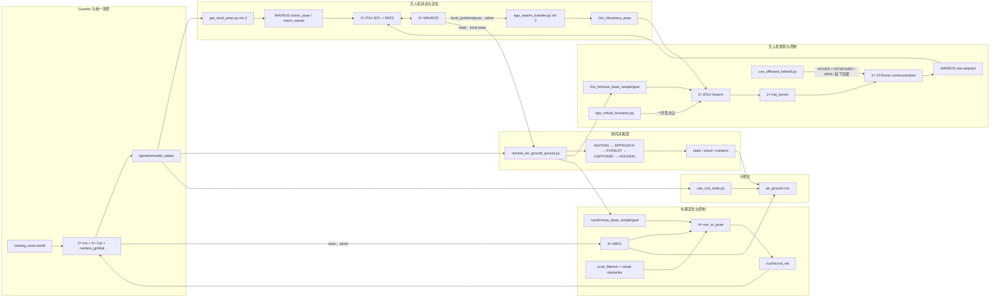
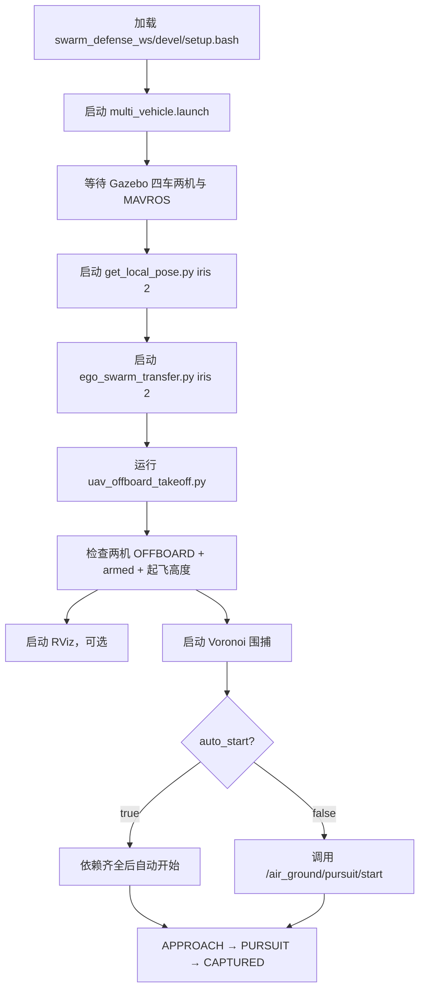
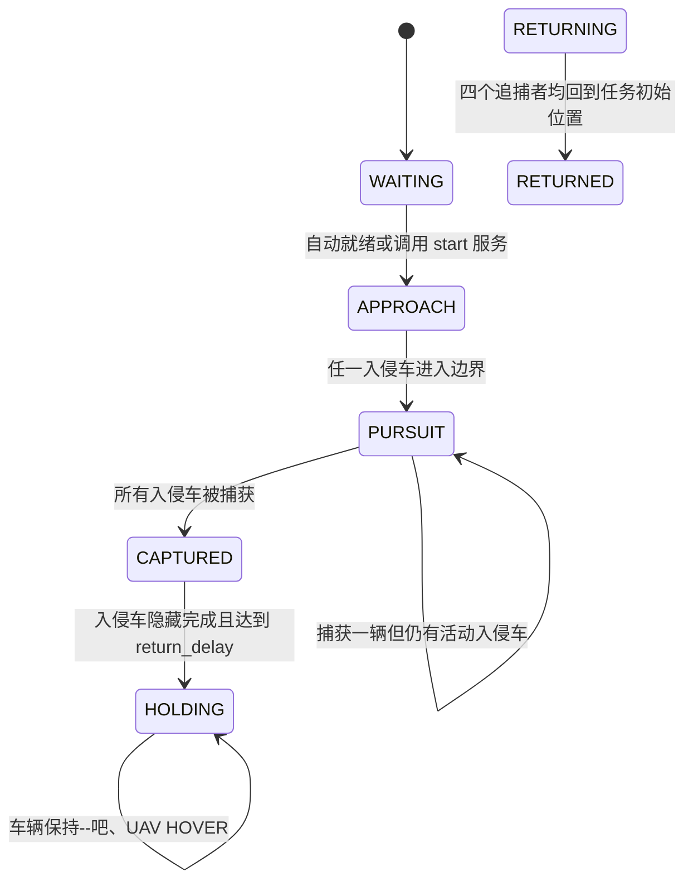

# 空地协同围捕项目框架

> 本文以当前工作区代码为准，适用于 ROS Noetic、Gazebo Classic、PX4 SITL、MAVROS、XTDrone、EGO-Swarm 和四车导航组成的空地协同仿真。
>
> 当前规模：两架追捕无人机 `iris_0`、`iris_1`，两辆追捕车 `car0`、`car1`，以及可切换单车或双车模式的入侵车辆 `car2`、`car3`。

## 1. 项目目标

系统在 Gazebo 的 `nesting_room.world` 中完成以下闭环：

1. PX4 SITL 和 MAVROS 控制两架 Iris 无人机；
2. Gazebo 真实位姿输入 PX4 EKF，不使用深度相机进行定位或建图；
3. EGO-Swarm 为无人机生成局部避障轨迹；
4. AMCL 和 `nav_to_pose` 控制四辆全向无人车；
5. Voronoi 围捕节点根据所有单位的 Gazebo 世界位姿实时计算目标点；
6. 两车两机追捕一辆或两辆入侵车；
7. 任意追捕者进入捕获距离后，记录捕获者和仿真用时，并将对应入侵车移出场景；
8. RViz 联合显示车辆、无人机轨迹、Voronoi 元胞、目标点和任务状态。

## 2. 工程目录与职责

| 目录 | 主要职责 |
|---|---|
| `/home/dev/PX4-Autopilot` | PX4 SITL、两机生成、MAVROS，以及整个空地系统的统一入口 launch |
| `/home/dev/XTDrone` | Gazebo 真实位姿转发、XTDrone 多机通信桥、EGO 位姿转换 |
| `/home/dev/XTDrone-single-car/workspace/swarm_defense_ws` | Gazebo 房间与车辆模型、车辆 Nav、Voronoi 围捕、一键起飞、RViz |
| `/home/dev/ego_ws` | EGO-Swarm 两机规划器和轨迹服务器 |
| `/home/dev/catkin_ws` | PX4/Gazebo ROS 依赖和相关仿真包 |

核心文件：

| 文件 | 作用 |
|---|---|
| `/home/dev/PX4-Autopilot/launch/multi_vehicle.launch` | 统一启动 Gazebo、四车、两机、MAVROS、车辆 Nav 和 EGO |
| `car3_swarm/launch/multi_car3_nav.launch` | 四车共享地图、AMCL、虚拟障碍和 `nav_to_pose` |
| `car3_swarm/launch/voronoi_air_ground_pursuit.launch` | 单/双入侵车 Voronoi 围捕参数与节点 |
| `car3_swarm/scripts/voronoi_air_ground_pursuit.py` | 围捕算法、状态机、捕获判据和捕获结果 |
| `car3_swarm/scripts/uav_offboard_takeoff.py` | 两机通信桥、OFFBOARD、ARM 和起飞的一键脚本 |
| `car3_swarm/scripts/ego_virtual_boundary.py` | 向两套 EGO 地图一次性注入带门洞的房间虚拟墙 |
| `car3_swarm/rviz/air_ground.rviz` | 空地联合 RViz 配置 |
| `XTDrone/sensing/pose_ground_truth/get_local_pose.py` | Gazebo 世界真值转 MAVROS vision pose/speed |
| `XTDrone/motion_planning/3d/ego_swarm_transfer.py` | MAVROS local pose 转 EGO `camera_pose` |
| `ego_planner/plan_manage/launch/multi_uav.launch` | 启动两套 EGO 规划器 |
| `ego_planner/plan_manage/launch/run_in_xtdrone.launch` | EGO 单机速度、加速度、地图和轨迹服务器配置 |

下文中相对路径 `car3_swarm/...` 均相对于：

```text
/home/dev/XTDrone-single-car/workspace/swarm_defense_ws/src
```

## 3. 系统架构图



### 3.1 无人机关键控制链

```text
/gazebo/model_states
  → get_local_pose.py
  → /iris_N/mavros/vision_pose/pose
  → PX4 EKF2
  → /iris_N/mavros/local_position/{pose,odom}
  → ego_swarm_transfer.py
  → /iris_N/camera_pose
  → EGO-Swarm

/iris_N/move_base_simple/goal
  → iris_N_ego_planner_node
  → /xtdrone/iris_N/planning/bspline
  → iris_N_traj_server
  → /xtdrone/iris_N/cmd_pose_enu
  → multirotor_communication.py
  → /iris_N/mavros/setpoint_raw/local
  → PX4
```

注意：

- 无人机定位来自 Gazebo 真实位姿，不是深度相机建图；
- `camera_pose` 是 EGO 的位姿输入接口名，不代表系统使用相机估计位姿；
- EGO 当前只通过 `ego_virtual_boundary.py` 接收一次性的房间边界点云；
- 虚拟墙不是持续刷新，避免持续点云拖慢 `gzserver`。

### 3.2 车辆关键控制链

```text
/gazebo + /carN/scan + /carN/odom
  → AMCL / virtual_obstacle_node
  → /carN/scan_filtered
  → nav_to_pose_node

/carN/move_base_simple/goal
  → nav_to_pose_node
  → /carN/cmd_vel
  → Gazebo ros_control
```

### 3.3 坐标系

- 车辆目标使用全局 `map` 坐标，当前场景中与 Gazebo `world` 基本一致；
- 每架 PX4 的 MAVROS local 坐标均以各自出生点附近为原点；
- Voronoi 节点在 Gazebo 世界坐标中计算目标；
- 发布 UAV 目标前，节点按当前世界位姿与 MAVROS local 位姿自动换算：

```text
local_target = world_target - (world_pose - local_pose)
```

因此围捕时不要额外手工减出生点，换算已经由追捕节点完成。

## 4. 核心启动流程

### 4.1 启动时序



必须遵守的顺序是：

```text
统一仿真 → Gazebo 真值 → EGO 位姿转换 → 一键 OFFBOARD/ARM/起飞 → 围捕
```

### 4.2 所有终端的环境加载

每个新终端先执行：

```bash
source /home/dev/XTDrone-single-car/workspace/swarm_defense_ws/devel/setup.bash
```

作用：

- 将 `swarm_defense_ws`、`ego_ws`、`catkin_ws` 叠加到 ROS 环境；
- 让 ROS 找到 `basic_room_sim`、`car3_swarm`、`ego_planner` 和 `px4`；
- 避免 `Resource not found: basic_room_sim`。

可先检查：

```bash
rospack find basic_room_sim
rospack find car3_swarm
rospack find ego_planner
rospack find px4
```

### 4.3 终端 1：启动统一空地仿真

```bash
source /home/dev/XTDrone-single-car/workspace/swarm_defense_ws/devel/setup.bash

roslaunch px4 multi_vehicle.launch \
  gui:=true \
  start_car_nav:=true \
  start_ego:=true
```

该命令完成：

1. 启动一个 `gzserver` 并载入 `nesting_room.world`；
2. 延时生成 `car0`～`car3`，避免并发生成导致模型缺失；
3. 延时生成 `iris_0`、`iris_1`；
4. 启动两套 PX4 SITL 和 MAVROS；
5. 启动四车地图、AMCL、虚拟障碍与 `nav_to_pose`；
6. 启动两套 EGO-Swarm 和轨迹服务器；
7. 向 EGO 一次性注入房间虚拟墙；
8. 启动 UAV 世界位姿与轨迹的 RViz 发布节点；
9. 在约 23 秒后启动 `gzclient`，一次获取完整场景。

不要因为启动初期 GUI 未立即出现而重复执行 launch；当前设计会延迟约 23 秒打开 GUI。

若只需要单入侵车追捕，统一场景仍可生成 `car3`，任务节点在 `intruder_mode:=single` 时不会控制或等待 `car3`。

### 4.4 终端 2：将 Gazebo 真值输入 PX4 EKF

```bash
source /home/dev/XTDrone-single-car/workspace/swarm_defense_ws/devel/setup.bash
cd /home/dev/XTDrone/sensing/pose_ground_truth
python3 get_local_pose.py iris 2
```

参数：

- `iris`：模型名前缀；
- `2`：处理 `iris_0` 和 `iris_1` 两架飞机。

作用：

```text
/gazebo/model_states
  → /iris_N/mavros/vision_pose/pose
  → /iris_N/mavros/vision_speed/speed
```

脚本以约 30 Hz 发布，必须保持运行。

### 4.5 终端 3：启动 EGO 位姿转换

```bash
source /home/dev/XTDrone-single-car/workspace/swarm_defense_ws/devel/setup.bash
cd /home/dev/XTDrone/motion_planning/3d
python3 ego_swarm_transfer.py iris 2
```

作用：

```text
/iris_N/mavros/local_position/pose
  → 姿态坐标转换
  → /iris_N/camera_pose
```

发布频率约 20 Hz。该步骤不能省略，否则 EGO 没有正确的位姿输入。

### 4.6 终端 4：一键通信、OFFBOARD、ARM 和起飞

```bash
source /home/dev/XTDrone-single-car/workspace/swarm_defense_ws/devel/setup.bash
rosrun car3_swarm uav_offboard_takeoff.py --altitude 1.5
```

脚本依次执行：

1. 检查两机 vision pose；
2. 检查两机 EGO `camera_pose`；
3. 自动启动缺失的 XTDrone `multirotor_communication.py`；
4. 等待 MAVROS connected 和 local pose；
5. 调整 PX4 地面检测相关阈值；
6. 先发送 HOVER，并检查持续 setpoint；
7. 调用 MAVROS 服务切换 `OFFBOARD`；
8. 调用 MAVROS arming 服务；
9. 发送本地起飞位姿，让两机原地上升到指定高度；
10. 保持脚本及其自动启动的通信桥运行。

常用选项：

```bash
# 起飞到 1.2 m
rosrun car3_swarm uav_offboard_takeoff.py --altitude 1.2

# 每个等待阶段超时 60 秒
rosrun car3_swarm uav_offboard_takeoff.py --altitude 1.5 --timeout 60

# 通信桥已手工启动时，不让脚本再启动
rosrun car3_swarm uav_offboard_takeoff.py --altitude 1.5 --no-start-bridge
```

手工启动通信桥的命令是：

```bash
cd /home/dev/XTDrone/communication
bash multi_vehicle_communication.sh
```

正常情况下优先使用一键脚本，避免通信桥重复启动。

### 4.7 终端 5：启动联合 RViz

```bash
source /home/dev/XTDrone-single-car/workspace/swarm_defense_ws/devel/setup.bash
rviz -d /home/dev/XTDrone-single-car/workspace/swarm_defense_ws/src/car3_swarm/rviz/air_ground.rviz
```

作用：

- 显示共享地图、车辆状态和轨迹；
- 显示 `iris_0`、`iris_1` 的 Gazebo 世界位姿与轨迹；
- 显示 Voronoi 边界、元胞、追捕目标、捕获圈和状态文字；
- 无需在 RViz 中加载 Iris 的真实网格模型。

### 4.8 终端 6：启动 Voronoi 围捕

双入侵车模式：

```bash
source /home/dev/XTDrone-single-car/workspace/swarm_defense_ws/devel/setup.bash
roslaunch car3_swarm voronoi_air_ground_pursuit.launch intruder_mode:=dual
```


单入侵车模式，只使用 `car2`：

```bash
roslaunch car3_swarm voronoi_air_ground_pursuit.launch intruder_mode:=single
```

默认 `auto_start:=true`。节点只有在以下条件全部满足后才自动开始：

- 所需 Gazebo 模型均存在；
- 两架 UAV 均有 MAVROS local pose；
- 两架 UAV 均 `connected + armed + OFFBOARD`；
- 所有参与单位的目标话题均有订阅者。

手动触发模式：

```bash
roslaunch car3_swarm voronoi_air_ground_pursuit.launch \
  intruder_mode:=dual \
  auto_start:=false
```

准备好后执行：

```bash
rosservice call /air_ground/pursuit/start "{}"
```

## 5. 围捕逻辑

### 5.1 参与单位

```text
追捕者：car0、car1、iris_0、iris_1
单入侵：car2
双入侵：car2、car3
```

### 5.2 入场和逃逸

- `car2` 从左侧入口进入；
- `car3` 从右侧入口进入；
- 入侵车进入 6 m 正方形前按 launch 中的 `intruder_routes` 行驶；
- 入侵车进入后，以自身有界 Voronoi 元胞质心方向生成逃逸目标；
- 追捕者优先前往与入侵车相邻的共享 Voronoi 边中点；若不相邻，则追向最近的活动入侵车；
- 所有目标被限制在边界内，并保留 `target_margin`。

### 5.3 捕获判据

对每辆已进入房间的活动入侵车，计算其与四个追捕者的二维平面距离：

```text
d_i = sqrt((x_i - x_evader)^2 + (y_i - y_evader)^2)
```

满足以下条件即捕获：

```text
min(d_i) <= capture_distance
```

当前 launch 默认 `capture_distance=0.5 m`。捕获后：

1. 发布捕获者、实际距离和该入侵车入场后的捕获用时；
2. 将被捕获车辆移动到场景外 `(x≈100, y=100, z=-10)`，不直接删除 ros_control 模型，以避免 `gzserver` 死锁；
3. 若仍有另一辆入侵车，继续追捕；
4. 所有入侵车捕获后停止两辆追捕车，并让两架 UAV 进入 HOVER。

结果示例：

```text
CAPTURED car2 by iris_0 at planar distance 0.287 m; capture time 18.627 s
ALL CAPTURED in 22.431 s | ...
```

### 5.4 当前状态机



已知限制：当前脚本实现了 `_begin_return()`、顺序 UAV 返航和 `RETURNING/RETURNED`，但现版状态机没有从 `HOLDING` 调用 `_begin_return()`。因此当前实际行为是捕获后保持，不会自动进入返航。后续若恢复自动返航，需要修复该转换后再使用第 6.2 节的返航参数。

## 6. launch 文件重要参数

### 6.1 统一入口 `multi_vehicle.launch`

文件：

```text
/home/dev/PX4-Autopilot/launch/multi_vehicle.launch
```

#### 功能开关

| 参数 | 当前默认值 | 作用 |
|---|---:|---|
| `world` | `$(find basic_room_sim)/worlds/nesting_room.world` | Gazebo 世界文件 |
| `gui` | `true` | 是否延时启动 `gzclient` |
| `paused` | `false` | Gazebo 启动时是否暂停物理 |
| `start_gazebo` | `true` | 是否启动 Gazebo server |
| `spawn_cars` | `true` | 是否生成四辆车 |
| `start_car_nav` | `true` | 是否启动四车 AMCL/Nav |
| `start_ego` | `false` | 是否启动两套 EGO；正式围捕应传 `true` |
| `use_ego_virtual_boundary` | `true` | 是否向 EGO 注入四面带门洞虚拟墙 |
| `start_uav_rviz_state` | `true` | 是否发布 UAV 世界位姿和轨迹供 RViz 使用 |
| `debug` | `false` | Gazebo 调试模式 |
| `verbose` | `false` | Gazebo 详细日志 |

#### 车辆出生点和速度

| 参数 | 当前默认值 | 含义 |
|---|---:|---|
| `car0_x, car0_y, car0_yaw` | `2.3, 2.4, -2.334` | 追捕车 car0 出生位姿 |
| `car1_x, car1_y, car1_yaw` | `-2.3, -2.4, 0.808` | 追捕车 car1 出生位姿 |
| `car2_x, car2_y, car2_yaw` | `-6.5, 6.6, 0.0` | 入侵车 car2 出生位姿 |
| `car3_x, car3_y, car3_yaw` | `6.5, -6.5, 3.14159` | 入侵车 car3 出生位姿 |
| `car2_max_vel_trans` | `3.00 m/s` | car2 最大平移速度覆盖值 |
| `car3_max_vel_trans` | `1.50 m/s` | car3 最大平移速度覆盖值 |

命令行覆盖示例：

```bash
roslaunch px4 multi_vehicle.launch \
  gui:=true \
  start_car_nav:=true \
  start_ego:=true \
  car2_max_vel_trans:=1.5 \
  car3_max_vel_trans:=1.5
```

#### UAV 出生点和通信端口

| UAV | Gazebo 出生点 | MAVROS FCU URL | MAVLink UDP/TCP |
|---|---|---|---|
| `iris_0` | `(-2.3, 2.3, 0)` | `udp://:14540@localhost:14580` | `18570 / 4560` |
| `iris_1` | `(2.3, -2.3, 0)` | `udp://:14541@localhost:14581` | `18571 / 4561` |

UAV 出生点当前直接写在两个 `single_vehicle_spawn_xtd.launch` include 中，不是顶层 arg。修改后需要完整重启统一仿真。

#### EGO 虚拟边界

| 参数 | 当前值 | 作用 |
|---|---:|---|
| `ego_boundary_z_max` | `3.0 m` | 虚拟墙高度 |
| `ego_boundary_spacing` | `0.3 m` | 墙点采样间距；越小点越密、规划负载越高 |
| `center_x, center_y` | `-0.11576, -0.00882` | 房间中心，写在 node 参数中 |
| `side` | `6.0 m` | 虚拟边界边长 |
| `gate_half_width` | 脚本默认 `0.6 m` | 四面门洞半宽 |
| `stable_samples` | `3` | 本地/世界原点偏移稳定样本数 |
| `stable_tolerance` | `0.05 m` | 原点稳定判据 |

### 6.2 围捕入口 `voronoi_air_ground_pursuit.launch`

文件：

```text
/home/dev/XTDrone-single-car/workspace/swarm_defense_ws/src/car3_swarm/launch/voronoi_air_ground_pursuit.launch
```

| 参数 | 当前默认值 | 作用 |
|---|---:|---|
| `intruder_mode` | `dual` | `single` 使用 car2；`dual` 使用 car2、car3 |
| `auto_start` | `true` | 依赖齐全后是否自动开始 |
| `start_delay` | `1.0 s` | 就绪状态持续多久后自动开始 |
| `capture_distance` | `0.5 m` | 二维捕获距离 |
| `boundary_side` | `6.0 m` | 有界 Voronoi 正方形边长 |
| `uav_altitude` | `1.5 m` | 追捕期间 UAV 世界目标高度 |
| `goal_period` | `0.25 s` | 地面单位目标检查周期，理论最高约 4 Hz |
| `uav_goal_period` | `0.8 s` | UAV 目标检查周期，理论最高约 1.25 Hz |
| `uav_goal_min_change` | `0.3 m` | UAV 目标变化至少达到此值才重发 |
| `target_margin` | `0.20 m` | 目标与 Voronoi 边界的最小内缩距离 |
| `goal_min_change` | `0.05 m` | 追捕车目标最小变化 |
| `evader_goal_min_change` | `0.08 m` | 入侵车目标最小变化 |
| `evader_lookahead` | `1.2 m` | 入侵车沿元胞质心方向的前视距离 |
| `route_tolerance` | `0.35 m` | 入侵车入场 waypoint 到达容差 |
| `rviz` | `false` | 是否随围捕 launch 启动 RViz |

捕获后/返航相关参数：

| 参数 | 当前默认值 | 作用 |
|---|---:|---|
| `return_delay` | `0.0 s` | 捕获完成到进入 HOLDING 的延迟 |
| `return_tolerance` | `0.25 m` | 追捕者回到任务初始位置的基础容差 |
| `uav_return_tolerance_margin` | `0.15 m` | UAV 在基础容差上额外增加的容差 |
| `return_goal_period` | `1.0 s` | 保持/返航目标检查周期 |
| `uav_return_retry` | `10.0 s` | UAV 返航无明显进展后的目标重发间隔 |
| `uav_home_clearance` | `0.8 m` | 判断某 UAV 是否占据另一 UAV 返航区域 |

注意：这些返航参数已经载入，但受当前 `HOLDING → RETURNING` 转换缺失影响，自动返航暂不生效。

常用调整示例：

```bash
roslaunch car3_swarm voronoi_air_ground_pursuit.launch \
  intruder_mode:=dual \
  capture_distance:=0.3 \
  uav_goal_period:=0.8 \
  uav_goal_min_change:=0.3 \
  uav_altitude:=1.5
```

### 6.3 四车 Nav 参数

公共参数文件：

```text
/home/dev/XTDrone-single-car/workspace/swarm_defense_ws/src/car3_control/params/nav_to_pose_params.yaml
```

| 参数 | 当前值 | 作用 |
|---|---:|---|
| `max_vel_trans` | `1.0 m/s` | 默认最大平移速度；car2/car3 可被顶层 launch 覆盖 |
| `max_vel_theta` | `2.0 rad/s` | 最大角速度 |
| `acc_lim_trans` | `2.0 m/s²` | 平移加速度限制 |
| `acc_lim_theta` | `2.0 rad/s²` | 角加速度限制 |
| `kp_trans` | `1.2` | 距离误差到平移速度的比例增益 |
| `kp_rot` | `2.5` | 航向误差到角速度的比例增益 |
| `slow_radius` | `0.6 m` | 进入该半径后线性减速 |
| `goal_radius` | `0.18 m` | 目标位置到达阈值 |
| `goal_radius_exit` | `0.35 m` | 位置漂出该范围后恢复平移 |
| `repulse_range` | `0.6 m` | 障碍物斥力作用距离 |
| `repulse_gain` | `0.8` | 斥力速度比例 |
| `escape_range` | `0.30 m` | 正前方触发侧向脱困的距离 |
| `escape_speed` | `0.25 m/s` | 侧向脱困速度 |
| `rate` | `20 Hz` | 控制循环频率 |

### 6.4 EGO-Swarm 参数

文件：

```text
/home/dev/ego_ws/src/ego_planner/plan_manage/launch/run_in_xtdrone.launch
```

| 参数 | 当前值 | 作用 |
|---|---:|---|
| `max_vel` | `1.0 m/s` | UAV EGO 最大轨迹速度 |
| `max_acc` | `2.0 m/s²` | UAV EGO 最大轨迹加速度 |
| `planning_horizon` | `7.5 m` | 局部规划视野 |
| `flight_type` | `1` | 使用 2D Nav Goal 接收动态目标 |
| `obj_num` | `6` | 动态对象数量配置 |
| `cloud_topic` | `pcl_render_node/points` | EGO 点云输入 |
| `odom_topic` | `mavros/local_position/odom` | EGO 里程计输入 |
| `traj_server/time_forward` | `1.0 s` | 轨迹服务器计算前视航向的时间，不是位置执行延迟 |

`multi_uav.launch` 当前地图范围：

```text
map_size_x = 100 m
map_size_y = 100 m
map_size_z = 5 m
```

EGO 最大速度修改后必须重启 EGO。目标频率过高不一定更快，因为 EGO 正在规划时会缓存最新动态目标，过度重发可能造成重规划负载。

## 7. 关键话题、服务和状态

### 7.1 关键话题

| 话题 | 类型/用途 |
|---|---|
| `/gazebo/model_states` | 所有模型 Gazebo 世界真值 |
| `/iris_N/mavros/vision_pose/pose` | 输入 PX4 EKF 的视觉位姿 |
| `/iris_N/mavros/local_position/pose` | PX4/MAVROS 本地位姿 |
| `/iris_N/mavros/local_position/odom` | EGO 里程计 |
| `/iris_N/camera_pose` | EGO 位姿输入 |
| `/iris_N/move_base_simple/goal` | UAV EGO 目标 |
| `/carN/move_base_simple/goal` | 车辆 Nav 目标 |
| `/xtdrone/iris_N/cmd` | `HOVER`、`OFFBOARD` 等 XTDrone 指令 |
| `/xtdrone/iris_N/cmd_pose_enu` | EGO 轨迹服务器输出的位姿指令 |
| `/air_ground/pursuit/state` | 围捕状态，latched |
| `/air_ground/pursuit/result` | 捕获结果与耗时，latched |
| `/air_ground/pursuit/markers` | RViz Voronoi 标记 |
| `/air_ground/iris_N/world_pose` | UAV Gazebo 世界位姿的 RViz 表示 |
| `/air_ground/iris_N/path` | UAV 世界轨迹 |

### 7.2 服务

| 服务 | 作用 |
|---|---|
| `/air_ground/pursuit/start` | `auto_start=false` 时手动开始 |
| `/iris_N/mavros/set_mode` | 切换 PX4 模式 |
| `/iris_N/mavros/cmd/arming` | ARM/DISARM |
| `/gazebo/pause_physics` | 暂停仿真物理 |
| `/gazebo/unpause_physics` | 恢复仿真物理 |

### 7.3 运行状态检查

```bash
# Gazebo 模型
rosservice call /gazebo/get_world_properties "{}"

# MAVROS 状态
rostopic echo -n 1 /iris_0/mavros/state
rostopic echo -n 1 /iris_1/mavros/state

# 真值、里程计和 EGO 位姿频率
rostopic hz /iris_0/mavros/vision_pose/pose
rostopic hz /iris_0/mavros/local_position/odom
rostopic hz /iris_0/camera_pose

# 围捕状态与结果
rostopic echo /air_ground/pursuit/state
rostopic echo /air_ground/pursuit/result

# 目标发布和控制输出
rostopic hz /iris_0/move_base_simple/goal
rostopic hz /xtdrone/iris_0/cmd_pose_enu
rostopic hz /car0/cmd_vel
```

两架 UAV 起飞后应满足：

```text
connected: True
armed: True
mode: "OFFBOARD"
```

## 8. 暂停、停止和冲突清理

### 8.1 只暂停 Gazebo 时间

```bash
rosservice call /gazebo/pause_physics "{}"
```

恢复：

```bash
rosservice call /gazebo/unpause_physics "{}"
```

### 8.2 停止围捕但保留仿真

```bash
rostopic pub -1 /xtdrone/iris_0/cmd std_msgs/String "data: 'HOVER'"
rostopic pub -1 /xtdrone/iris_1/cmd std_msgs/String "data: 'HOVER'"
rosnode kill /voronoi_air_ground_pursuit
```

### 8.3 一键正常停止项目相关进程

```bash
pkill -INT -f '[/]voronoi_air_ground_pursuit.py'
pkill -INT -f '[/]uav_offboard_takeoff.py'
pkill -INT -f '[/]multirotor_communication.py iris [01]'
pkill -INT -f '[/]ego_swarm_transfer.py iris 2'
pkill -INT -f '[/]get_local_pose.py iris 2'
pkill -INT -f '[/]roslaunch px4 multi_vehicle.launch'

sleep 10

pgrep -af 'roslaunch px4 multi_vehicle.launch|rosmaster|gzserver|gzclient|get_local_pose.py|ego_swarm_transfer.py|uav_offboard_takeoff.py|multirotor_communication.py|voronoi_air_ground_pursuit.py'
```

不要使用 `killall python3`，它会误杀无关 Python 进程。重新启动时仍需严格遵守第 4 节的顺序。

## 9. 常见问题定位

| 现象 | 优先检查 |
|---|---|
| `Resource not found: basic_room_sim` | 当前终端是否 source 了 `swarm_defense_ws/devel/setup.bash` |
| Gazebo GUI 未出现 | 等待约 23 秒；检查 `DISPLAY`、XLaunch 和 `gzclient` |
| Gazebo 少车或少飞机 | 是否重复启动；检查生成延时、`/gazebo/model_states` 和残留进程 |
| EGO 一直 `no odom` | `get_local_pose.py`、MAVROS local odom、`ego_swarm_transfer.py` |
| OFFBOARD 或 ARM 失败 | MAVROS connected、持续 setpoint、vision pose 和一键起飞脚本日志 |
| UAV 严重滞后 | EGO `max_vel`、入侵车 `max_vel_trans`、`uav_goal_period`、`uav_goal_min_change` |
| CPU/内存突然升高 | 是否重复启动 EGO/通信桥；目标更新是否过快；虚拟点云是否被改成持续发布 |
| 捕获后不返航 | 当前版本停在 `HOLDING`，状态机尚未连接到 `RETURNING` |
| 大量 XML-RPC Connection refused | ROS Master 或顶层 roslaunch 已退出；先清理残留，再完整重启 |

## 10. 推荐的基准启动命令

为使两辆入侵车速度一致并与当前围捕设置配合，可使用：

```bash
source /home/dev/XTDrone-single-car/workspace/swarm_defense_ws/devel/setup.bash

roslaunch px4 multi_vehicle.launch \
  gui:=true \
  start_car_nav:=true \
  start_ego:=true \
  car2_max_vel_trans:=1.5 \
  car3_max_vel_trans:=1.5
```

完成真值、transfer 和一键起飞后：

```bash
roslaunch car3_swarm voronoi_air_ground_pursuit.launch \
  intruder_mode:=dual \
  capture_distance:=0.3 \
  uav_goal_period:=0.8 \
  uav_goal_min_change:=0.3
```

当前 EGO UAV 最大速度仍为 `1.0 m/s`，而上述入侵车上限为 `1.5 m/s`。若要求水平速度接近，应单独评估并修改 EGO `max_vel`，然后重启两套 EGO。
